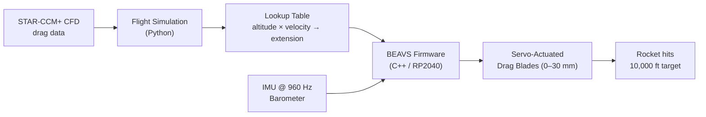
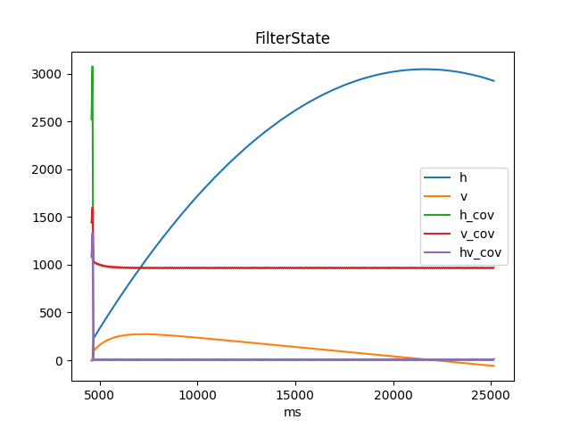

# SCRT BEAVS — Active Altitude Control for Competitive Rocketry
 
In altitude-targeting rocket competitions, teams are scored on how close to the target their rocket apogee lands. A fixed-motor rocket easily overshoots or undershoots by hundreds of feet depending on atmospheric conditions, motor variance, and launch angle. BEAVS solves this by extending physical drag blades during the unpowered ascent to bleed off excess altitude in real time — no pyrotechnics, no parachutes, just aerodynamics. The result is a rocket that can stop within a handful of feet of the target.
 
---
 
## How It Works



*CFD-derived drag data feeds a Python simulation that pre-computes a lookup table. During flight, onboard firmware fuses IMU and barometer readings, queries the table, and drives the drag blades to steer apogee to target.*

---

## Key Features

### 🎯 Precision Altitude Targeting
Four selectable blade extension positions (0, 5, 15, and 30 mm) give fine-grained control over drag, closing the gap between predicted and target apogee even in varied atmospheric conditions and launch angles up to 20°.

### 📡 Real-Time Sensor Fusion
An Extended Kalman Filter (EKF) running at 960 Hz on the onboard RP2040 microcontroller fuses high-rate accelerometer data with slower but absolute barometer readings to continuously estimate altitude and velocity during flight — the same principle used in aircraft autopilots.

### 🔭 Physics-Based Pre-Flight Simulation
A Python simulation incorporates drag coefficients computed from STAR-CCM+ computational fluid dynamics (CFD) runs at multiple blade extension positions. It sweeps flight conditions to produce lookup tables the firmware uses the instant the rocket clears the rail.

### 💀 Flash-Backed Mid-Flight Recovery
Flight state is continuously logged to onboard flash memory. If the board reboots during flight — from vibration or a power glitch — it recovers its last known altitude and velocity and resumes control automatically.

### 🧪 Hardware-in-the-Loop Testing
A built-in test framework injects simulated sensor streams directly into the firmware, verifying control decisions on the bench before any hardware risk.

---

## Explore the Code

| Repository | What's inside |
|---|---|
| [**firmware**](https://github.com/SCRT-Capstone-2025-26/firmware) | C++/PlatformIO firmware for the BEAVS 2026 board (EKF, state machine, flash logging) |
| [**SCRT\_Rocket\_SIM**](https://github.com/SCRT-Capstone-2025-26/SCRT_Rocket_SIM) | Python flight simulation, CFD data pipeline, and lookup table generation |

### Try the Simulation

**Requirements:** Python 3.x, pip

```bash
git clone https://github.com/SCRT-Capstone-2025-26/SCRT_Rocket_SIM
cd SCRT_Rocket_SIM
python -m venv venv && source venv/bin/activate
pip install -r requirements.txt
python3 simulation/sim.py        # opens altitude, velocity, and angle plots
```

Running `sim.py` produces interactive plots of flight altitude (m), velocity (m/s), and angle over time for each blade extension setting, letting you compare how aggressively extending the blades changes apogee.

### Flash the Firmware

**Requirements:** [PlatformIO](https://platformio.org/), [BEAVS 6](https://github.com/osu-asdt/beavs-6) board

```bash
git clone https://github.com/SCRT-Capstone-2025-26/firmware
cd firmware
pio run -e release -t upload
```

See [analysis/CALIBRATION.md](https://github.com/SCRT-Capstone-2025-26/firmware/blob/main/analysis/CALIBRATION.md) for board calibration steps. Linux users need a one-time udev rule for USB access — full details in the [firmware README](https://github.com/SCRT-Capstone-2025-26/firmware#readme).

## Firmware Sim



This is an example graph showing an old firmware based simulation created by running the test build on the board.

---

## Team

| Name | GitHub |
|---|---|
| Noah Unger-Schulz | [@NoahUnger-Schulz](https://github.com/NoahUnger-Schulz) |
| Forrest Felsch | [@blazakin](https://github.com/blazakin) |
| Zane | [@5t0n3](https://github.com/5t0n3) |
| Kai | [@Llarence](https://github.com/Llarence) |

This project was developed as an OSU CS Capstone (2025–26) in partnership with OSU AIAA SCRT.

**Questions or feedback?** Open an [issue](https://github.com/SCRT-Capstone-2025-26/SCRT_Rocket_SIM/issues) on the simulation repo.

